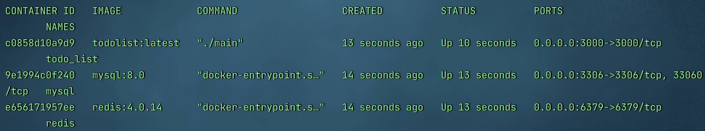

# ToDoList
# 1、项目描述
本项目实现了一个备忘录，可以作为一个Go入门项目。主要涉及到如下的一些技术：

- 语言：Go
- 框架：Gin、Gorm
- 数据库：mysql、Redis（保存阅读量）
- 细节：jwt、go-swagger、Restful
# 2、实现功能
- 用户
  - 用户注册
  - 用户登陆
- 任务
  - 创建一条任务
  - 查看一条任务
  - 更新一条任务
  - 删除一条任务
  - 查看所有任务
  - 搜索一条任务


# 3、项目框架


# 4、项目API
- [ToDoList API](https://www.showdoc.com.cn/2117826241503629/9518449753495922)密码：eGGatNMd
- 或者启动项目后访问 <a>http://localhost:3000/swagger/index.html</a>

# 6、配置文件
请注意另外本配置文件属于测试环境，需要更换成你自己的配置。
# 5、本地启动本项目
本人环境：macos + go 1.19（go version > 1.11）
- 克隆到本地
```bash
git clone git@github.com:HumbleSwage/ToDoList.git
cd TodoList
```
- 下载依赖
```bash
go mod tidy
```
- 运行项目
```bash
go run .
```


# 6、docker启动

```bash
cd ToDoList
docker-compose up -d
```


